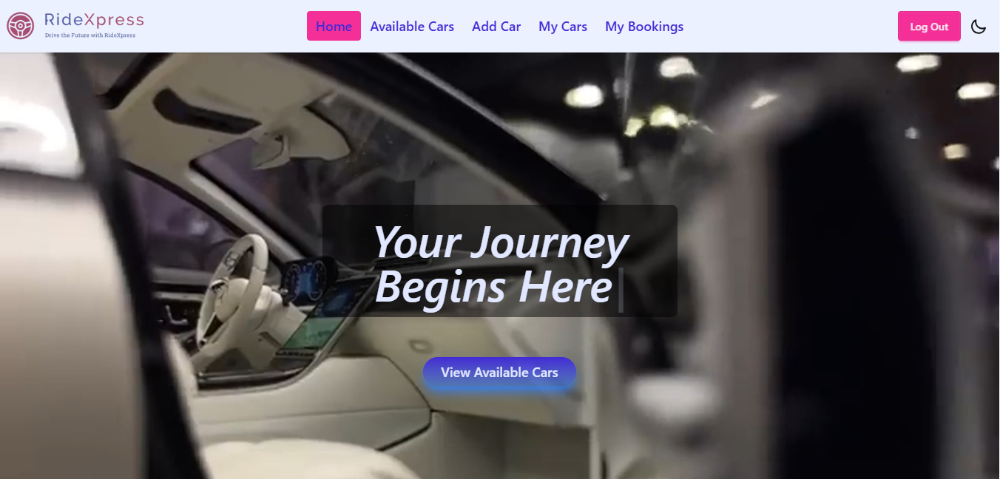
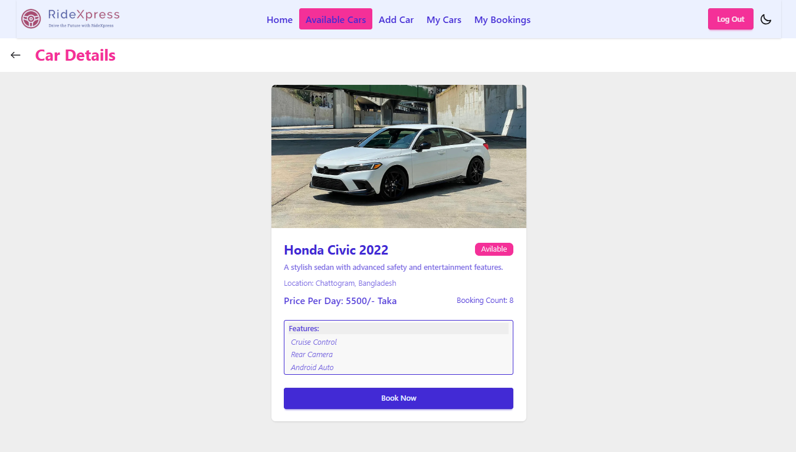
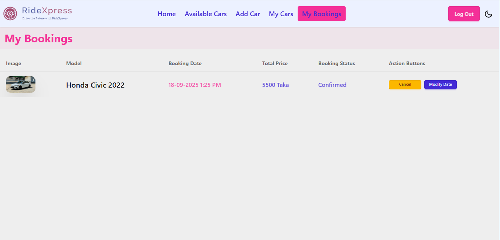

# 🚗 RideXpress

RideXpress is a **car rental system** built with the MERN stack, designed to make car booking seamless, secure, and user-friendly. Whether you need a ride for a day or a week, RideXpress connects you with a wide variety of vehicles at affordable prices.

---

## 🌟 Key Features

- 🔑 **User Authentication** – Secure login & registration with Firebase (Google & Email/Password).
- 🚘 **Car Management** – Add, update, and delete cars with complete details.
- 📅 **Smart Booking System** – Book cars by date range, with real-time availability.
- 📊 **Data Visualization** – View rental insights using Recharts on the booking page.
- 🔍 **Search & Filters** – Search by model, brand, or location. Sort cars by price or date added.
- 📱 **Responsive Design** – Fully optimized for desktop, tablet, and mobile.
- 🔒 **JWT Authentication** – Secure backend routes and protect private pages.
- 🎨 **Theming** – Stylish UI built with TailwindCSS + DaisyUI.

---

## 📂 Tech Stack

**Frontend:** React.js, TailwindCSS, DaisyUI, Motion
**Backend:** Node.js, Express.js, MongoDB
**Authentication:** Firebase, JWT
**Deployment:** Netlify (Client) & Vercel (Server)

---

## 📑 Pages & Routes

- 🏠 **Home** – Banner, Why Choose Us, Recent Listings, Offers, Explore by Location
- 🚘 **Available Cars** – View all available cars with search, sorting & filters
- ➕ **Add Car** (Private) – Add new cars for rental
- 📋 **My Cars** (Private) – Manage cars added by the user
- 📅 **My Bookings** (Private) – View and manage all bookings made by the user
- ℹ️ **Car Details** – Detailed page with booking option
- 🔑 **Login & Register** – Authentication system with Firebase
- ❌ **Error Page** – Custom 404 with theme styling

---

## ⚙️ Installation

1. Clone the repositories:

   ```bash
   git clone <client-repo-url>
   git clone <server-repo-url>
   ```

2. Install dependencies:

   ```bash
   cd client
   npm install

   cd ../server
   npm install
   ```

3. Create a `.env` file in both client & server with the following variables:

   **Client**

   ```
   VITE_apiKey
   VITE_authDomain
   VITE_projectId
   VITE_storageBucket
   VITE_messagingSenderId
   VITE_appId
   ```

   **Server**

   ```
   PASSWORD
   SECRET_KEY
   ```

4. Run locally:

   ```bash
   # client
   npm run dev

   # server
   npm start
   ```

---

## 🚀 Deployment

- **Client** deployed on **Netlify**
- **Server** deployed on **Vercel**
- Ensure environment variables are set properly in deployment platforms.

---

## 🔑 NPM Packages Used

**Frontend:** react-router-dom, axios, framer-motion, recharts, firebase, tailwindcss, daisyui
**Backend:** express, mongoose, cors, dotenv, jsonwebtoken
**Database:** MongoDB

---

## 📸 Screenshots

| Home Page                     | Car Details                                 | My Bookings                              |
| ----------------------------- | ------------------------------------------- | ---------------------------------------- |
|  |  |  |

---

## 🔗 Live Links

- 🌍 **Live Website:** [https://ridexpressbd.netlify.app](#)
- 💻 **Client Repo:** [https://github.com/KYusufbd/RideXpress-client-side](#)
- ⚙️ **Server Repo:** [https://github.com/KYusufbd/RideXpress-server-side](#)

---

## 👨‍💻 Author

Developed by **Yusuf** – MERN Stack Web Developer
